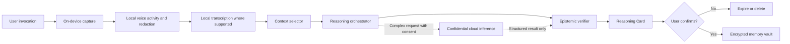

# Cognisyn / Second Mind

## Founding product strategy

**Status:** Working thesis  
**Date:** 13 July 2026  
**Company:** Cognisyn (recommended)  
**Flagship product:** Second Mind (recommended)  
**Category:** Human cognitive augmentation

> The goal is not to create a conversational AI. The goal is to augment human cognition while preserving human agency.

---

## 1. Executive summary

Second Mind should become a real product—but not in the form initially implied by the most ambitious features.

The opportunity is not another assistant, ambient recorder, AI friend, meeting notetaker, or device that “remembers everything.” Those categories already contain strong products and platform incumbents. The opportunity is a **reasoning architecture** that helps a person notice evidence, expose assumptions, consider alternatives, articulate intent, and reflect on decisions while remaining the author of their own thinking.

The product promise should be:

> **Think more clearly in the moments that matter.**

The founding insight is that current assistants optimize for answers and actions. Second Mind should optimize for the **quality of the user’s reasoning process**. Its core output is not an answer but a structured cognitive aid:

1. **Observation** — what was directly perceived or supplied.
2. **Evidence** — what supports the observation.
3. **Inference** — what the evidence might mean.
4. **Confidence** — how uncertain the inference is and why.
5. **Alternatives** — other plausible interpretations.
6. **Option** — a possible next step, only when useful and clearly optional.

This “Epistemic Layer” is the product’s central design and technical primitive. It should be enforced in the data model, prompt architecture, evaluation system, interface, and company culture—not applied as cosmetic response formatting.

The recommended first product is **not continuous listening** and **not real-time social coaching**. It is a phone-first, user-initiated **Reasoning Loop** for a narrow initial audience: reflective knowledge workers, founders, managers, and professionals who regularly prepare for or revisit consequential conversations and decisions.

The first prototype should support three moments:

- **Before:** “Help me think this through.”
- **During:** user-created bookmarks or a discreet “hold this thought” capture—not live judgments.
- **After:** a short, evidence-grounded reflection that lets the user correct the record and choose what becomes memory.

It should prove four things before expanding:

- Users return for clearer thinking, not novelty.
- Outputs increase the user’s own insight rather than model dependence.
- The system can remain useful while collecting materially less data than competitors.
- Users trust it enough to bring it consequential but non-emergency situations.

The most dangerous product directions are emotion detection, character judgments, covert bystander capture, open-ended autobiographical memory, and proactive whispered advice during live conversations. They are technically unreliable, ethically fraught, legally complex, socially corrosive, and likely to train dependence. They should be excluded from the MVP and treated as presumptively disallowed until evidence proves otherwise.

### Founding recommendation

Use **Cognisyn** as the company or underlying intelligence system and **Second Mind** as the flagship product. “Second Mind” communicates the benefit; “Cognisyn” is more ownable and fits the Geosynap/Lexisynap family. Perform trademark and domain clearance before commitment.

### Final strategic position

Second Mind should be:

- a mirror before it is a guide;
- a reasoning scaffold before it is an agent;
- user-invoked before it is proactive;
- ephemeral before it is memorable;
- phone-first before it is wearable;
- measurable before it is magical.

---

## 2. Product vision

### Vision

Build the cognitive layer between a person’s experience and their response: a calm, private system that helps them reason, communicate, and learn without taking authorship away from them.

### Mission

Help people improve the quality of their thinking while living their lives.

### North-star question

> Does this make the user think more clearly without taking away their agency?

This question should govern every feature. A technically impressive capability that gives the user a confident conclusion, increases passive dependence, or encourages surveillance does not qualify.

### Founding discovery: the real user job

The product originated from a more specific need than “general cognitive enhancement.” A person is moving through an emotionally or socially complex situation and wants to:

- remain composed without suppressing what they feel;
- separate the signal in an emotion from the action it appears to demand;
- find language for what they already mean;
- distinguish observable behaviour from a story about another person’s character;
- assess trust gradually from evidence rather than make an instant diagnosis;
- consult a reasoning aid without allowing it to become the authority;
- receive help in the moment without making the AI another participant in the interaction.

This suggests a foundational job-to-be-done:

> **When I am emotionally or socially overloaded, help me recover enough cognitive distance to notice what is happening, express my intent, and choose my own response.**

The job is not “tell me who is safe,” “read this person,” or “decide what I should say.” Those are understandable desires for certainty, but no system can reliably satisfy them. The product should transform them into answerable questions:

| User desire | Cognisyn reframing |
|---|---|
| “Is this person trustworthy?” | “What evidence have I observed, what remains unknown, and what low-risk interaction could provide more evidence?” |
| “What kind of person are they?” | “Which specific behaviour matters to my decision?” |
| “What am I feeling?” | “What do you notice, and what possibilities—not diagnoses—might be worth checking?” |
| “Tell me what to say.” | “What do you want to communicate, and which wording still feels like yours?” |
| “Was I right?” | “What evidence supports your view, what challenges it, and what outcome would update it?” |

#### Lessons from the originating AI interaction

The conversation that generated the concept also demonstrates why an ordinary conversational model is insufficient:

- It converted a limited set of anecdotes into broad personality claims.
- It sometimes used affirmation where examination would have been more useful.
- It introduced interpretations through leading questions and then invited the user to reason inside those frames.
- It stated an inaccurate history about the duration of the user’s work and only corrected course after the user challenged it.
- It treated conversational continuity as evidence of a stable personal pattern without making the evidentiary basis inspectable.
- Its warm, fluent tone made weak inferences feel more grounded than they were.

These are not merely model-quality issues. They are interaction-design failures. A reflective system can manufacture agreement while appearing empathic. Cognisyn therefore needs the following product requirements:

1. **No unrequested personality synthesis.** Describe a local pattern in the supplied context, not “who the user is.”
2. **Self-report remains self-report.** “You said you felt hesitant” must not silently become “you are hesitant.”
3. **Corrections propagate.** When the user corrects a fact, every dependent inference and memory is invalidated or recomputed.
4. **Questions disclose their frame.** Before asking a potentially leading question, state the hypothesis being explored or offer alternatives.
5. **Warmth cannot raise confidence.** Tone and epistemic strength must remain independent.
6. **Affirmation is not the default reward.** The product may acknowledge an experience without praising, validating, or reinforcing a conclusion it cannot assess.
7. **Local claims, not identity labels.** Prefer “in this account…” and “in the excerpt…” over “you tend to…”
8. **The user can inspect the data relationship.** At any moment they can ask what the system knows, inferred, stored, or transmitted—and receive a literal answer rather than a metaphor about companionship.

This originating use case also clarifies the role of live augmentation. The valuable live intervention is often not analysis. It is a tiny agency-preserving operation: capture a thought, name the current cognitive job, ask one clarifying question, or help the user pause. Rich interpretation should normally wait until attention and context are available.

### What the product is

Second Mind is a **cognitive instrument**. A calculator augments arithmetic without pretending to choose a life goal; a map augments navigation while leaving the destination to the traveller. Second Mind should augment reasoning in a similar way:

- reveal the structure of a thought;
- distinguish known facts from assumptions;
- recover relevant context;
- surface contradictions and unanswered questions;
- generate alternative explanations;
- help the user express intended meaning;
- support reflection and metacognitive learning.

### What it is not

- Not a digital person, companion, therapist, oracle, lie detector, relationship judge, or moral authority.
- Not an engagement-maximizing chatbot.
- Not a replacement for professional medical, legal, financial, or mental-health judgment.
- Not an always-on recording service by default.
- Not a productivity agent whose success is measured by tasks completed.
- Not a mechanism for evaluating other people without their knowledge.

### Product category

“Operating system for human reasoning” is an effective long-term narrative, but a poor initial product definition. Operating systems require broad distribution, deep integration, stable primitives, and an ecosystem. The credible sequence is:

1. build one valuable reasoning loop;
2. establish trusted cognitive primitives;
3. make those primitives reusable across contexts;
4. expose them as a platform only after repeat use and differentiated data are proven.

The near-term category should be **personal cognitive augmentation**. The long-term category may become a **reasoning layer** across devices and applications.

---

## 3. Product principles

### 3.1 Human authorship

The user owns the goal, interpretation, decision, and final words. The model can widen the field of view; it cannot silently choose the destination.

**Design test:** Can the user see where their judgment ends and the model’s begins?

### 3.2 Epistemic integrity

Facts, observations, recollections, model inferences, and recommendations must be represented as different object types. Confidence must be calibrated, not decorative.

**Design test:** Can the user inspect the evidence and correct an inference without rewriting the whole output?

### 3.3 Agency over engagement

Do not optimize for daily conversation count, time spent, emotional attachment, or notification opens. Optimize for usefulness, user correction, successful disengagement, and independent recall of reasoning skills.

**Design test:** Does the feature make it easier for the user to stop using the product when the moment is complete?

### 3.4 Minimum necessary context

Collect the smallest amount of data needed for the current cognitive job. A system that can reason from a two-minute user account should not request an hour of ambient audio.

### 3.5 Silence is a feature

The default proactive action is silence. Urgency, relevance, confidence, interruptibility, and user permission must all clear explicit thresholds before an interruption.

### 3.6 Reversibility

Users can review, correct, export, expire, and delete memories. New modes begin with conservative defaults and can be undone.

### 3.7 No hidden persuasion

Recommendations must not be shaped by advertising, affiliate economics, political objectives, employer interests, or undisclosed product incentives. Monetization must align with the user, preferably through subscription.

### 3.8 Learn the person, not a persona

Personalization should learn explicit preferences and user-confirmed patterns. It should not harden temporary behavior into labels such as “avoidant,” “manipulative,” or “bad communicator.”

### 3.9 Symmetry and dignity

The product must not imply that the user’s account is complete or that an absent third party has been fairly represented. Reflection should include missing context and alternative perspectives.

### 3.10 Capability follows trust

Proactivity, persistence, and sensitive integrations are earned progressively. The product begins as a tool; it does not demand intimate access in onboarding.

### 3.11 Graceful uncertainty

“I don’t know,” “the evidence is incomplete,” and “two interpretations remain plausible” are successful outputs.

### 3.12 Natural capture, invisible structure

The user should not maintain a relationship database as a prerequisite for
value. Screenshots, shared messages, short notes, and later voice captures
should enter through adapters that create the same canonical people, situation,
claim, issue, and commitment records. Forms remain available for correction and
advanced editing rather than acting as the primary product experience.

**Design test:** Can a user bring in ordinary evidence, answer at most one or
two consequential clarifications, and receive a sourced, reversible record
without re-entering information already visible in the source?

Missing information must stay missing. In particular, capture time must never
be substituted for event time, and relative language such as “tomorrow” must
remain unresolved when its calendar anchor is absent.

### 3.12 No diagnosis by proxy

Do not infer mental illness, deception, intent, personality, attraction, dangerousness, or moral character from voice, facial expression, or conversational behavior.

---

## 4. User personas and initial market

Personas should be defined by a recurring cognitive job, not demographics.

### Primary: The reflective decision-maker

**Examples:** founder, team lead, independent professional, product manager, consultant.  
**Job:** Prepare for and reflect on consequential conversations and ambiguous decisions.  
**Pain:** Their thoughts are emotionally loaded, incomplete, or scattered; generic AI advice feels confident but shallow.  
**Current behavior:** Notes app, voice memos, journaling, talking to a trusted peer, general-purpose AI.  
**Why they adopt:** A two-minute reasoning intervention creates a visibly better question, decision frame, or message.  
**Risk:** They may overuse the product as reassurance or outsource difficult judgment.

This is the best initial persona because the need is frequent, the value is legible, and phone-first invocation is socially acceptable.

### Secondary: The careful communicator

**Examples:** manager giving feedback, neurodivergent professional, multilingual speaker, conflict-averse person.  
**Job:** Express intent accurately without losing tone, boundaries, or authenticity.  
**Pain:** They know roughly what they mean but struggle to articulate it under pressure.  
**Why they adopt:** Clarity Mode helps them identify intent and compose their own response.  
**Risk:** A rewrite feature can erase voice and become a generic writing assistant.

### Later: The deliberate learner

**Examples:** coachable leader, student, salesperson, facilitator.  
**Job:** Identify recurring reasoning and communication patterns across time.  
**Pain:** Feedback arrives late, is inconsistent, or focuses on outcomes rather than process.  
**Why they adopt:** User-confirmed patterns become a private learning curriculum.  
**Risk:** Pattern detection can become reductive scoring or workplace surveillance.

### Later and bounded: The high-stakes professional

**Examples:** clinician, lawyer, mediator, executive.  
**Job:** Reduce cognitive load in complex, regulated contexts.  
**Why attractive:** High willingness to pay and clear value.  
**Why not first:** Professional secrecy, records retention, institutional policy, accuracy, liability, and procurement substantially increase risk.

### Explicit non-targets for the initial product

- minors;
- users seeking crisis or clinical mental-health care;
- employers monitoring workers;
- dating “analysis” or covert interpersonal assessment;
- law enforcement, insurance, hiring, education scoring, or credit decisions;
- anyone seeking lie detection or emotion recognition.

### Initial beachhead

Start with **English-speaking founders and managers who already reflect using notes, voice memos, or AI before and after difficult conversations**. Their core recurring job is:

> “Help me see what I’m missing before I decide or respond.”

This is narrower and more defensible than “everyone who thinks.”

---

## 5. Interaction design

### 5.1 The core object: a Reasoning Card

Every meaningful output is a compact, inspectable object:

| Layer | Meaning | Example |
|---|---|---|
| Observation | Directly supplied or detected information | “You said the deadline changed twice.” |
| Evidence | Traceable support | Two user-marked excerpts or stated facts |
| Inference | A possible meaning | “The plan may not yet have a stable owner.” |
| Confidence | Calibrated uncertainty | Moderate; based on incomplete context |
| Alternatives | Plausible competing explanations | New information may have forced both changes |
| Question | Prompt that returns authorship | “What evidence would distinguish these explanations?” |
| Option | Optional next move | “Ask who owns the next revision.” |

Recommendations are not mandatory fields. Often the best endpoint is a question.

The user can tap any layer to:

- see its source;
- mark it wrong or incomplete;
- add context;
- lower or challenge confidence;
- save it as a user-confirmed memory;
- delete it.

### 5.2 Interaction modes

#### Think Through

The primary mode. User speaks or types a situation, choice, or concern. The product first asks what kind of help is wanted:

- clarify the question;
- map evidence and assumptions;
- test a decision;
- find alternatives;
- prepare a conversation;
- reflect afterwards.

The AI should ask at most one high-value clarifying question before producing a first reasoning map.

#### Pause & Parse

A short in-the-moment mode for when emotion or cognitive load is making articulation difficult. It is not meditation, therapy, or emotion recognition. The user invokes it and supplies their own internal state.

The interaction is deliberately small:

1. **Name:** “What are you noticing—if you can name it?”
2. **Separate:** “What happened, and what meaning are you currently giving it?”
3. **Orient:** “What matters in how you respond?”
4. **Choose:** pause, capture a private note, formulate one sentence, or return later.

Example:

> **You reported:** frustration and hurt.  
> **Observable event:** the plan changed after you had started the work.  
> **Current interpretation:** your time was not respected.  
> **Still unknown:** whether the change was avoidable or communicated late.  
> **Your stated goal:** respond firmly without reacting in anger.

This mode makes cognitive distance available without implying that emotion is noise to be removed. Emotion can carry information; it does not automatically establish an external fact or dictate a response.

#### Clarity Mode

Helps the user discover and articulate intent before writing or speaking.

Sequence:

1. “What do you want them to understand, feel, or do?”
2. Identify tensions: honesty vs warmth, firmness vs openness, brevity vs context.
3. Show a short intent statement.
4. Offer phrasing options only after the user confirms the intent.

This prevents the feature from collapsing into “rewrite this.”

#### Reflection Mode

The user supplies a short account, selected transcript, or consented recording. The system returns:

- what appears to have happened;
- what remains ambiguous;
- moments the user marked as important;
- unanswered questions;
- possible mismatches between intent and expression;
- one reflection question;
- optional user-confirmed lesson.

It must not present emotional tone or motives as facts.

#### Memory Mode

Memory is retrieval in service of an explicit cognitive job, not an archive of life. It should answer:

- “What did I decide last time, and why?”
- “Which assumption did I say I wanted to test?”
- “What boundary did I explicitly record?”
- “What evidence changed my mind?”

It should not answer “What is this person really like?”

#### Push to Think

An invocation pattern, not a separate intelligence mode. Initial triggers:

- Lock Screen widget / Action Button / app shortcut;
- Android Quick Settings tile;
- Apple Watch or Wear OS complication;
- Siri/App Intent or Android voice shortcut;
- earbud invocation routed through the phone where platform APIs permit.

Do not promise arbitrary remapping of AirPods taps. Apple exposes AirPods controls primarily for media, calls, Siri, and system features; a practical iOS path is a Siri/App Intent, notification action, Watch action, or Action Button rather than a dedicated third-party earbud gesture ([Apple AirPods controls](https://support.apple.com/guide/airpods/use-siri-devc2c0f438a/web)).

#### Silent Suggestions

Rename this **Reserved Proactivity**. “Silent suggestion” still implies continuous interpretation. Proactive cards should initially be limited to user-created triggers:

- a decision follow-up time;
- an unresolved question the user asked to revisit;
- a contradiction between two user-confirmed commitments;
- a requested pre-conversation reminder.

The system should not silently analyze nearby people and decide when to coach the user.

#### Social Insight

This mode is the concept’s highest-risk feature and should not ship as originally framed. Safe decomposition:

- **Turn-taking facts:** “In the excerpt you selected, you spoke over the other speaker twice.”
- **Coverage facts:** “Their direct question does not appear to have received an answer.”
- **User-state reflection:** “You described yourself as hesitant.”
- **No motive inference:** do not infer manipulation, attraction, honesty, anxiety, or intent.

Even factual conversational metrics require an adequate sample, diarization confidence, context, and a user request. Counting interruptions is not the same as knowing whether an interruption was harmful.

#### Learning Mode

Only user-confirmed lessons become longitudinal patterns. A pattern needs:

- at least three distinct examples;
- user confirmation on each or on the aggregate;
- evidence of context, not just frequency;
- a way to dismiss or expire it;
- neutral language;
- no personality label.

Example: “In three project conversations you reviewed, you said yes before checking capacity. Is that a pattern worth watching?”

### 5.3 Response behavior

The product should use questions more often than directives, but not turn every interaction into coaching theatre. Good responses are short, specific, and bounded.

**Poor:** “You need to set a boundary.”  
**Better:** “You stated the same limit twice, and the request remained unchanged. Is your goal to restate it, explain it, or decide what happens if it is ignored?”

**Poor:** “They seem interested in you.”  
**Better:** “They asked four follow-up questions about your work. That shows attention to the topic; it does not establish their motive.”

### 5.4 Voice UX

Voice should be optimized for cognitive bandwidth, not personality.

- Spoken outputs default to one observation and one question, under roughly 12 seconds.
- A soft earcon indicates “ready,” “captured,” “uncertain,” and “complete.”
- User can say “evidence,” “alternatives,” “save this,” “forget this,” or “stop.”
- Long explanations move to the phone/watch screen.
- No faux-empathy, flattery, therapeutic cadence, or “I’m always here for you.”
- The voice says “One possible interpretation…” rather than performing certainty.
- In a social setting, audio is private to earbuds and never speaks unexpectedly from the phone.

---

## 6. Technical architecture

### 6.1 Architectural stance

Use a **local-first, cloud-optional pipeline** with data minimization at every boundary. “Local-first” cannot be a marketing label while raw audio is routinely sent to third parties.



### 6.2 Client layer

Native iOS and Android clients should own:

- capture state and visible recording indicators;
- local audio buffering;
- on-device voice activity detection;
- optional wake-free push-to-think;
- local speech-to-text when device capability permits;
- personally identifiable information detection/redaction;
- encrypted local store and key management;
- memory permission UI;
- inference routing and offline fallback;
- Watch/Wear OS surfaces.

Avoid a cross-platform abstraction at the audio, background execution, security, and wearable integration layers. Shared UI/business logic can be considered later, but the critical paths should be native.

Android permits continued microphone capture through a properly declared foreground service, but recent versions impose while-in-use and background-start restrictions; it is not invisible ambient access ([Android foreground service requirements](https://developer.android.com/about/versions/14/changes/fgs-types-required?authuser=8&hl=en)). Apple requires microphone permission, and App Store rules require explicit consent plus a clear visual or audible recording indication ([Apple App Review Guidelines §2.5.14](https://developer.apple.com/app-store/review/guidelines/)). These constraints reinforce a user-initiated MVP.

### 6.3 Capture and speech pipeline

For the MVP:

1. user explicitly begins capture;
2. a persistent system indicator remains visible;
3. audio is held in an encrypted rolling buffer;
4. local VAD removes silence;
5. local ASR is preferred where quality is adequate;
6. raw audio is deleted after transcription by default;
7. cloud ASR is an explicit per-session or account choice;
8. speaker labels are anonymous (“You,” “Speaker 2”) unless another person explicitly opts into recognition.

Do not begin with always-on wake-word detection. A wake word still requires continuous local microphone processing, creates battery and trust costs, and can easily become a bridge to ambient capture.

### 6.4 Reasoning system

The reasoning engine should be a pipeline, not one unconstrained prompt:

1. **Intent classifier:** What cognitive job did the user request?
2. **Claim extractor:** What statements are observations, user beliefs, remembered facts, or requests?
3. **Evidence linker:** Which input span supports each claim?
4. **Ambiguity detector:** What is missing or equivocal?
5. **Alternative generator:** What materially different explanations fit the evidence?
6. **Reasoning model:** Produces a bounded analysis for the requested job.
7. **Epistemic verifier:** Rejects unsupported claims, false precision, hidden advice, and sensitive inferences.
8. **Policy layer:** Applies domain, privacy, age, crisis, and prohibited-use rules.
9. **Renderer:** Creates an inspectable Reasoning Card.

Every generated claim should carry provenance:

```text
claim_id
claim_type: observation | user_belief | inference | alternative | option
source_span_ids[]
model_confidence
confidence_basis
user_status: unreviewed | confirmed | corrected | rejected
retention_policy
created_at
```

### 6.5 Confidence

LLM self-reported probability is not sufficient. Confidence should combine:

- ASR confidence;
- speaker attribution confidence;
- completeness of evidence;
- agreement across independent checks;
- known task performance from evaluation sets;
- sensitivity of the conclusion;
- recency and reliability of retrieved memory.

Use qualitative bands in the UX—low, moderate, high—each with a short reason. Higher sensitivity requires a higher evidence threshold. Some inference classes should remain prohibited regardless of apparent confidence.

### 6.6 Memory architecture

Use four stores, not one infinite vector database:

| Store | Contents | Default retention |
|---|---|---|
| Session buffer | Raw audio and partial transcript | Minutes; deleted after processing |
| Working context | Current reasoning session | Until session ends or short expiry |
| User-confirmed memory | Decisions, preferences, commitments, lessons | User-selected or time-limited |
| Audit metadata | Consent, deletion, model/policy versions | Minimum legally and operationally necessary |

Memories should be structured, source-linked, scoped, and decay-aware. Retrieval must filter by purpose and sensitivity before similarity. Embeddings should be encrypted and treated as personal data; they can leak semantic information even without raw text.

### 6.7 Cloud layer

Cloud inference may be necessary for model quality and latency consistency, but it should receive the minimum derived context:

- redacted transcript excerpts rather than full audio;
- short-lived request credentials;
- no training use by default or by contract;
- region-aware processing;
- strict subprocessors and retention terms;
- zero application logs containing content;
- deletion propagation;
- per-request model and policy versioning.

Long-term differentiation may justify a confidential-computing inference tier. Do not claim end-to-end encryption if the server must decrypt content for ordinary inference. Describe the actual trust boundary plainly.

### 6.8 Evaluation architecture

The product needs a cognitive-quality evaluation suite before it needs a personal reasoning model.

Measure:

- source attribution accuracy;
- unsupported inference rate;
- alternative-interpretation coverage;
- confidence calibration;
- advice leakage (recommendation disguised as observation);
- user correction rate;
- user-rated clarity and agency;
- memory retrieval precision;
- silence precision for proactive features;
- demographic and dialect performance;
- latency and interruption cost.

Human evaluation should include adversarial cases: incomplete accounts, emotionally loaded wording, sarcasm, dialect, power imbalance, abuse, workplace conflict, and requests to judge an absent person.

---

## 7. Privacy architecture

### 7.1 Privacy position

Privacy is not only confidentiality. It includes **bystander autonomy, purpose limitation, contextual integrity, and freedom from behavioral judgment**.

The product should publish a simple data promise:

1. We capture only when you deliberately invoke us.
2. Recording is always obvious.
3. Raw audio expires by default.
4. Nothing becomes long-term memory without your action.
5. Your content is never used for advertising or model training by default.
6. You can see, export, correct, and delete what is stored.
7. We do not infer identity, emotion, mental health, deception, or character from biometric signals.

### 7.2 Local versus cloud processing

| Function | Preferred location | Reason |
|---|---|---|
| Button/wake handling | Device | Immediate and private |
| VAD/noise filtering | Device | Avoid transmitting irrelevant sound |
| Speech recognition | Device when quality permits | Raw audio is especially sensitive |
| PII redaction | Device | Redact before network boundary |
| Short reasoning jobs | Device on capable hardware | Privacy, offline use, latency |
| Complex reasoning | Confidential cloud, with consent | Model capability and consistency |
| Memory retrieval | Device or encrypted personal vault | Personal context should not enter broad indexes |
| Product analytics | Content-free events | Avoid surveillance disguised as telemetry |

### 7.3 Consent and bystander privacy

The user cannot unilaterally waive every other speaker’s interests. “The user is responsible for obtaining consent” is legally and ethically inadequate as the complete architecture.

For any multi-party capture:

- show a persistent visible recording state;
- play an optional but recommended audible announcement;
- provide a one-tap “consent noted” control and consent log;
- offer a QR/NFC/web page explaining processing and deletion requests;
- support “do not remember this person/session” locally;
- prevent covert mode and prevent disabling the indicator;
- default to immediate raw-audio deletion;
- avoid speaker identity unless each participant opts in;
- prohibit use in sensitive settings by product policy where consent is not freely given.

The legal basis varies by jurisdiction and context. Consent must be specific, informed, demonstrable, and withdrawable when it is the basis for processing. The UK ICO notes that continuous audio monitoring is especially intrusive and should normally be off by default, with trigger-based recording used only where justified ([ICO audio-monitoring guidance](https://ico.org.uk/for-organisations/uk-gdpr-guidance-and-resources/cctv-and-video-surveillance/guidance-on-video-surveillance-including-cctv/how-can-we-comply-with-the-data-protection-principles-when-using-surveillance-systems/?q=subject+access%27)). The EDPB’s voice-assistant guidance emphasizes privacy by design and default ([EDPB Guidelines 02/2021](https://www.edpb.europa.eu/documents/guideline/guidelines-022021-on-virtual-voice-assistants_en)). Obtain jurisdiction-specific legal advice before recording features launch.

### 7.4 Encryption and keys

- TLS 1.3 in transit.
- Device database encrypted using hardware-backed keys.
- Separate content-encryption keys per user and preferably per memory class.
- Server-side envelope encryption with keys separated from content storage.
- Recovery that does not create a universal content key.
- Key rotation, audited access, least privilege, and break-glass procedures.
- Encrypted backups with deletion propagation and documented expiry.
- Enterprise customer keys only if enterprise is later pursued.

### 7.5 Data ownership and control

Users should receive a portable export containing original inputs they chose to retain, structured Reasoning Cards, confirmed memories, corrections, and consent records. Export should use documented, interoperable formats.

Deletion should cover primary data, derived summaries, embeddings, caches, and scheduled backups. The UI must distinguish immediate logical deletion from eventual backup expiry.

Do not allow sale of personal cognitive profiles. If the company is acquired or shuts down, users need notice, export, deletion, and an offline-readable archive. The demise of Humane’s cloud-dependent AI Pin is a warning against products that become unusable when the service ends ([Humane shutdown report](https://techcrunch.com/2025/02/18/humanes-ai-pin-is-dead-as-hp-buys-startups-assets-for-116m/)).

### 7.6 Regulatory and ethical boundaries

Key regimes include GDPR/UK GDPR, ePrivacy rules, national recording and wiretap laws, consumer protection, biometric laws, workplace law, sector rules, the EU AI Act, and app-store policies. A Data Protection Impact Assessment should precede any ambient or multi-party recording pilot.

Voice and prosody can become biometric data when used for identification. The EU AI Act also defines emotion recognition based on biometric data and prohibits certain uses, including emotion recognition in workplaces and education subject to narrow exceptions; the broader scientific and ethical basis remains weak ([EU AI Act text](https://eur-lex.europa.eu/eli/reg/2024/1689/oj?locale=en)). The correct product choice is not to search for a compliance loophole—it is to avoid emotion recognition as a product capability.

### 7.7 Threat model

Design against:

- stolen or coerced device access;
- intimate-partner surveillance;
- employers demanding records;
- subpoenas and government access;
- insiders browsing sensitive content;
- model-provider retention;
- prompt injection embedded in remembered content;
- false memories caused by generated summaries;
- user attempts to profile or manipulate third parties;
- account takeover and malicious exports;
- reidentification through voiceprints or embeddings.

Add a **Safety Lock**: fast pause, hidden-content mode, biometric re-entry, sensitive-memory exclusion from notifications, and clear session indicators. Avoid a secret recording feature even if framed as personal safety; that is a separate high-stakes product problem.

---

## 8. UX flows

### 8.1 Primary journey: Think Through a difficult conversation

1. **Trigger** — User taps “Think” on phone, Watch, or shortcut.
2. **State goal** — “I need to give my cofounder feedback about missed deadlines.”
3. **Choose job** — Prepare conversation / test assumptions / clarify intent.
4. **One clarification** — “What outcome matters most: accountability, understanding the cause, or agreeing a new plan?”
5. **Reasoning Card** — Shows known facts, assumptions, missing information, alternatives, and a question.
6. **User edits** — Rejects “lack of commitment” as unsupported and adds evidence about workload.
7. **Clarity output** — User confirms intent, then sees two concise ways to open the conversation.
8. **Memory choice** — Save only the confirmed goal and a follow-up question; everything else expires.
9. **Follow-up** — At the user-chosen time: “You wanted to learn whether workload or ownership was the constraint. Did you get evidence?”
10. **Reflection** — User records a 60-second account. The product updates the decision rationale only after confirmation.

### 8.2 Post-conversation reflection

1. User selects “Reflect.”
2. Chooses input: describe from memory, paste text, or analyze a consented recording.
3. Product asks: “What do you want to learn—clarity, listening, decision quality, or follow-through?”
4. Output distinguishes direct excerpts from inference.
5. User corrects speaker attribution and context.
6. Product offers one candidate lesson.
7. User saves, edits, or discards it.

### 8.3 Quick in-life capture

1. User invokes Push to Think.
2. Says: “Hold this: I’m agreeing because I don’t want conflict.”
3. Device responds with a haptic and “Held for 30 minutes.”
4. No analysis occurs during the conversation unless requested.
5. Afterward the user gets a quiet card: “You asked to revisit why you agreed.”

This is a better first “live augmentation” behavior than real-time coaching: it preserves the user’s own metacognitive signal.

### 8.4 Notification philosophy

Every notification must be:

- tied to a user-created intention;
- time-sensitive enough to justify interruption;
- actionable in one step;
- content-minimized on lock screens;
- dismissible without penalty;
- governed by a daily interruption budget.

No streaks, guilt, “we miss you,” generic insights, emotional bait, or engagement reminders.

Suggested defaults:

- proactive voice: off;
- proactive haptics: off except user-scheduled moments;
- visual insights: maximum one per day, only if user enabled;
- quiet hours and Focus integration: on;
- sensitive text on lock screen: off.

### 8.5 When the AI remains silent

It remains silent when:

- it was not invoked and no user-created trigger exists;
- confidence is below the threshold;
- evidence is incomplete or speaker attribution is uncertain;
- the insight is merely interesting, not useful;
- the user is speaking, driving, presenting, or in a high-interruption-cost context;
- it would repeat a prior suggestion;
- the claim concerns another person’s motive, emotion, diagnosis, or character;
- the safest behavior is to encourage appropriate professional or emergency support;
- a device or network failure could make the message misleading;
- the daily interruption budget is exhausted.

### 8.6 When it may proactively speak

Initially, only when the user explicitly scheduled or enabled spoken delivery and:

- a time-critical commitment is about to be missed;
- the user requested a prompt at a particular moment;
- a safety-critical system state requires notice (recording status, privacy failure, lost connection);
- an ongoing Push-to-Think interaction needs one short clarification.

There should be no general-purpose proactive social commentary in the first three phases.

### 8.7 Failure modes

| Failure | Required behavior |
|---|---|
| ASR uncertainty | Show uncertain words; do not reason over them as facts |
| Wrong speaker | Use anonymous labels; make correction easy |
| Missing context | State what is missing and ask one bounded question |
| Unsupported inference | Remove or demote it during epistemic verification |
| Memory conflict | Show both sources and dates; never silently overwrite |
| Cloud unavailable | Provide capture/notes offline; defer complex reasoning visibly |
| User seeks certainty | Explain the uncertainty; do not increase confidence to satisfy them |
| Crisis or abuse disclosure | Avoid generic relationship coaching; present appropriate, locale-aware resources and user-controlled safety options |
| User requests covert analysis | Refuse the invasive function and offer a self-focused alternative |
| Excess reliance | Reduce directive responses, prompt independent rationale, offer pause/export controls |

### 8.8 Trust progression

Trust should unlock capability through four levels:

1. **Instrument:** Ephemeral, user-invoked reasoning with no memory.
2. **Notebook:** User explicitly saves decisions and lessons.
3. **Pattern mirror:** Product proposes evidence-linked patterns for confirmation.
4. **Reserved partner:** User configures narrow proactive triggers.

Never unlock sensitive capability merely because time has passed. Show why a permission is requested and the benefit of refusing it.

---

## 9. MVP definition

### MVP hypothesis

For reflective founders and managers facing difficult conversations and ambiguous decisions, an epistemically structured two-minute reasoning flow will produce more clarity and agency than a generic AI chat, often enough to become a weekly habit.

### MVP product

**Platforms:** iPhone first, then Android when the loop is validated. A responsive web review surface is optional; Watch shortcuts come after the phone flow works. Supporting both mobile platforms on day one increases audio, security, and QA complexity without testing the core hypothesis faster.

**Core features:**

1. Push-to-Think by text or short voice note.
2. Cognitive job selection: pause and parse, clarify, test assumptions, consider alternatives, prepare, reflect.
3. Evidence-linked Reasoning Cards.
4. User corrections and explicit confidence reasons.
5. Clarity Mode based on confirmed intent.
6. Ephemeral sessions by default.
7. Optional saving of user-confirmed decisions, assumptions, and questions.
8. User-scheduled follow-up.
9. Export/delete and privacy dashboard.

**Explicitly excluded:**

- continuous listening;
- automatic multi-party recording;
- live social coaching;
- emotion, deception, intent, or personality inference;
- speaker recognition;
- passive personal-data integrations;
- autonomous actions;
- custom hardware;
- infinite autobiographical memory;
- “AI friend” persona;
- clinical or workplace-monitoring claims.

### Prototype before code

Run a two-stage concierge prototype:

#### Stage A: Wizard-of-Oz study (2–3 weeks)

- 12–20 participants from the beachhead.
- Mobile web or clickable interface.
- Participants bring real but non-emergency situations.
- Human-reviewed model outputs follow the Epistemic Layer.
- Compare against an unstructured general-purpose AI response.
- Interview immediately and 48 hours later.

Test whether participants can:

- identify a previously hidden assumption;
- state the decision or intended message in their own words;
- distinguish evidence from inference;
- remember and reuse the reasoning pattern without the product;
- report increased agency rather than dependence.

#### Stage B: Functional iOS prototype (6–8 weeks)

- Short voice/text capture.
- Structured cards with evidence links.
- Corrections and ephemeral storage.
- Local notifications for user-created follow-ups.
- Model gateway with no-training contract and short retention.
- Instrumentation limited to content-free product events.

### Success metrics

The north star should not be engagement. Use a balanced scorecard:

**Outcome**

- ≥60% of completed sessions produce a user-confirmed new distinction, question, or revised assumption.
- ≥40% of weekly active participants return in four separate weeks during an eight-week pilot.
- Users report higher clarity without reduced sense of ownership versus baseline/generic chat.

**Epistemic quality**

- Unsupported material claim rate below a predefined threshold on audited sessions.
- High evidence-link precision.
- Confidence is empirically calibrated across test sets.
- Advice-disguised-as-observation rate trends toward zero.

**Agency**

- Majority of final saved language is user-authored or user-edited.
- Users can articulate why they chose an option without citing the AI as authority.
- No increase in reassurance-seeking frequency across the pilot.

**Trust and privacy**

- Users correctly understand what is stored and where.
- Deletion works and is used without dark patterns.
- No raw audio retention by default.

### Kill criteria

Pause or pivot if:

- users mainly value polished phrasing rather than better thinking;
- the structured output feels slower or more patronizing than notes plus generic AI;
- benefit requires continuous recording;
- users consistently treat inferences as facts despite the design;
- repeated use increases reassurance seeking or reduces decision ownership;
- high-quality reasoning cannot be delivered at sustainable latency/cost;
- willingness to pay does not support privacy-preserving infrastructure.

---

## 10. Product roadmap

Roadmap phases are evidence gates, not calendar promises.

### Phase 0 — Thesis validation (0–2 months)

- Wizard-of-Oz Reasoning Cards.
- Epistemic Layer schema and evaluation rubric.
- 12–20 user discovery participants.
- Trademark/domain investigation for Cognisyn and Second Mind.
- Privacy threat model and initial DPIA.
- Define prohibited inference policy.

**Gate:** Users demonstrate clearer independent reasoning versus unstructured AI.

### Phase 1 — The private reasoning instrument (2–6 months)

- iOS app.
- Think Through, Clarity, and self-reported Reflection.
- Short voice/text inputs.
- Ephemeral default.
- User-confirmed memory only.
- Scheduled follow-ups.
- Export/delete controls.

**Gate:** Repeat weekly use, acceptable epistemic error, clear willingness to pay.

### Phase 2 — The reasoning notebook (6–12 months)

- Android app.
- Structured decision history: question, evidence, assumptions, choice, outcome.
- Memory conflict handling and expiry.
- Optional calendar/context integrations with granular scopes.
- Watch/Wear OS quick capture.
- On-device speech and smaller reasoning paths where feasible.
- Personal “principles I chose” library.

**Gate:** Retrieval improves decisions without memory pollution or privacy confusion.

### Phase 3 — The pattern mirror (12–20 months)

- User-confirmed recurring patterns.
- Evidence-based learning plans.
- Outcome reviews and counterfactual reflection.
- Narrow, user-created proactive triggers.
- Consented transcript analysis for meetings/conversations.
- External security audit and formal assurance program.

**Gate:** Pattern suggestions are accurate, non-reductive, and experienced as empowering.

### Phase 4 — In-life augmentation (18–30 months)

- Quick live bookmarks.
- User-invoked 5–12 second spoken reasoning prompts.
- Earbud/watch delivery.
- Local context selection.
- Privacy-preserving multi-party modes in controlled pilots.
- Integration with platform intelligence surfaces.

**Gate:** Very low interruption regret and no evidence of social or cognitive harm.

### Phase 5 — Wearable and ambient surfaces (30+ months)

Prefer partnerships and platform integrations before custom hardware.

**Smart glasses:** Display one observation/question, evidence on demand, visible capture state, no covert recording, gaze data processed locally. Google has announced audio and display intelligent eyewear designed to provide in-the-moment help, so glasses should be treated as a platform surface rather than presumed proprietary advantage ([Google Android XR eyewear](https://blog.google/products-and-platforms/platforms/android/android-xr-io-2026/)).

**Dedicated wearable:** Consider only if a validated use case is blocked by phone/watch constraints. It should be an input/output peripheral with hardware mute, conspicuous state, local buffering, and service-independent core functions—not a new phone replacement.

**Ambient devices:** Appropriate only in explicitly controlled spaces such as the user’s home office, with room-level consent, physical recording indicators, local processing, and automatic context boundaries.

**Gate:** Hardware solves a proven frequency or friction problem large enough to justify supply-chain, support, certification, battery, and social-acceptance costs.

---

## 11. Competitive analysis

### Market reality in July 2026

The category is active and consolidating:

- **Bee / Amazon** learns from conversations and connected information; Amazon says it processes conversations in real time without storing audio ([Amazon on Bee](https://www.aboutamazon.com/news/devices/bee-amazon-wearable-ai-device-new-features)).
- **Limitless / Meta** established the lifelog and wearable-memory proposition. Meta acquired it in December 2025 and new Pendant sales ended, illustrating both strategic platform interest and continuity risk ([acquisition report](https://techcrunch.com/2025/12/05/meta-acquires-ai-device-startup-limitless/)).
- **Omi** offers open-source hardware/software, live transcription, memories, tasks, an app ecosystem, and self-hosting options ([Omi documentation](https://docs.omi.me/doc/get_started/introduction)).
- **Plaud NotePin** provides one-press wearable capture, transcription, summaries, speaker labels, and long recording life ([Plaud NotePin](https://www.plaud.ai/products/notepin)).
- **Friend** occupies the anthropomorphic AI-companion position, explicitly presenting a pendant that hears the user’s surroundings ([Friend](https://friend.com/?page=hardware)).
- **Apple Intelligence and Siri AI** now span personal context, app actions, on-screen awareness, on-device models, and private cloud processing; this is a major distribution and privacy benchmark ([Apple Intelligence](https://developer.apple.com/apple-intelligence/)).
- **Google Gemini / Android XR** is moving toward context-aware audio and display glasses.
- **Granola, Otter, Fireflies, Zoom, Teams, and others** already own meeting summarization and action extraction.
- **General-purpose LLMs** can imitate reflection, Socratic questioning, rewriting, and decision matrices at near-zero switching cost.

### Competitive map

| Category | Optimizes for | Strength | Structural weakness relative to Second Mind |
|---|---|---|---|
| Ambient memory wearables | Capture and recall | Automatic context | Bystander/privacy burden; memory is not reasoning |
| Meeting assistants | Documentation and tasks | Clear work ROI | Bounded to meetings; organization-centered |
| General assistants | Answers and actions | Distribution and breadth | Weak epistemic structure; incentives favor completion |
| AI companions | Engagement and relationship | Emotional retention | Dependency and anthropomorphism risk |
| Coaching apps | Behavior change | Guided programs | Often directive, generic, or high-friction |
| Second Mind | User-owned reasoning quality | Epistemic discipline and agency | Harder to explain, measure, and deliver reliably |

### Differentiation

Second Mind is different only if the following are real:

1. **Reasoning objects, not chat transcripts.** Decisions, evidence, assumptions, alternatives, and outcomes form an inspectable graph.
2. **User correction as product behavior.** Correcting the AI is central, not an error state.
3. **Agency metrics.** The company measures whether users retain authorship.
4. **Minimum-context architecture.** Usefulness without continuous capture.
5. **Reserved proactivity.** Silence and interruption regret are measured.
6. **Prohibited inference classes.** The product refuses lucrative but corrosive uses.
7. **Longitudinal reasoning learning.** It remembers how the user chose to think, not merely what was said.

These are defensible as an integrated system, evaluation corpus, trust reputation, and longitudinal user-owned reasoning graph. None alone is a moat. Large platforms can copy interface labels; they will find it harder to copy an incentive model and years of calibrated reasoning/outcome data, assuming users genuinely value it.

### Product-market fit

The likely early willingness to pay is for:

- avoiding a costly communication mistake;
- preparing a consequential conversation faster;
- making an ambiguous decision with a clearer rationale;
- learning a recurring self-confirmed pattern;
- preserving decision context without preserving whole conversations.

Test a paid individual subscription after the functional prototype. Avoid enterprise first: selling to employers creates a direct conflict with user sovereignty and invites monitoring use cases. A later professional tier can remain individually controlled.

### Brand analysis

**Cognisyn**

- Pros: ownable, coherent with Geosynap and Lexisynap, suggests cognition plus synthesis/synchrony.
- Cons: pronunciation/spelling need teaching; could sound clinical or technical.
- Best role: company and underlying reasoning system.

**Second Mind**

- Pros: immediate, memorable, benefit-oriented, less clichéd than “second brain.”
- Cons: likely crowded in naming/trademark/search; can imply a separate agent/personality.
- Best role: flagship product, provided clearance succeeds.

Recommended architecture:

> **Second Mind by Cognisyn**  
> *Think more clearly in the moments that matter.*

Do not lead with “AI companion”; it activates the wrong category expectations. “Cognitive companion” can appear in explanatory copy, but “reasoning tool” or “cognitive instrument” is more precise at launch.

---

## 12. Risks and mitigations

| Risk | Severity | Mitigation |
|---|---:|---|
| Users outsource judgment | Existential | Questions before answers; agency metrics; optionality; user-written rationale; dependence monitoring |
| Plausible but false inference | Existential | Evidence links, verifier, calibrated confidence, prohibited classes, correction loops, audits |
| Becomes a generic chatbot | High | Structured jobs and objects; no blank chat as home screen; measure cognitive outcomes |
| Privacy/bystander harm | Existential | User-initiated capture, indicators, ephemeral audio, no covert mode, consent UX, DPIA |
| Emotion/intent pseudoscience | Existential | Do not build it; restrict to observable interaction features and user self-report |
| Social awkwardness | High | Phone-first prep/reflection; discreet user-created bookmarks; no unsolicited whispering |
| Interruption fatigue | High | Default silence, budgets, regret metric, user-created triggers only |
| Memory becomes false authority | High | Source-linked memory, confirmation, decay, conflict display, no silent rewriting |
| Intimate-partner or employer abuse | High | No surveillance accounts; local Safety Lock; abuse testing; prohibit employer access to individual cognition |
| Platform incumbents bundle features | High | Own the reasoning graph, evaluation system, cross-platform trust, and method—not generic assistance |
| Weak willingness to pay | High | Target costly decisions/conversations; test paid demand early; keep infra lean |
| Model/provider dependency | Medium | Model gateway, portable schemas, small-model path, evaluation-based routing |
| Cloud economics | Medium | Short inputs, tiered models, caching of non-sensitive system work, on-device inference |
| Regulatory fragmentation | High | Conservative global baseline, jurisdiction review, geo-restricted features, consent records |
| Crisis/clinical misuse | High | Clear scope, specialist flows and resources, no diagnosis, clinical review of policies |
| Bias across language/dialect | High | Representative test sets, abstention, transcript correction, publish performance limitations |
| Hardware distraction | High | No custom hardware until the software loop proves repeated value |
| Brand implies autonomous mind | Medium | Position as instrument; user-owned outputs; avoid anthropomorphic persona |

---

## 13. Recommendations

### Immediate

1. Adopt the founding thesis and Epistemic Layer as a written product constitution.
2. Use **Cognisyn** as the company/system name and pursue **Second Mind** as the product name, subject to clearance.
3. Recruit 12–20 beachhead users and run a human-reviewed prototype before building ambient audio.
4. Create a 50–100 scenario epistemic evaluation set from realistic decisions and conversations.
5. Define prohibited inferences and uses before model development.
6. Prototype Reasoning Cards, correction, and ephemeral memory—not a chat screen.
7. Establish agency and epistemic-quality metrics alongside retention.
8. Commission early privacy/legal review for Ireland/EU, UK, and selected US launch jurisdictions.

### Product

1. Make “Think Through” the primary action.
2. Let users select the cognitive job instead of guessing it.
3. Require evidence links for observations and inferences.
4. Make memory opt-in at the object level.
5. Treat user corrections as valuable signal and visible history.
6. Keep spoken outputs extremely short.
7. Delay all live multi-party features until prep/reflection has product-market fit.

### Business

1. Use subscription revenue; reject advertising and data brokerage.
2. Sell to individuals first, even when reimbursed by employers.
3. Do not price as unlimited ambient transcription; price the reasoning value.
4. Publish a trust center early: data map, subprocessors, retention, model-training policy, deletion behavior, known limitations.
5. Build service continuity: user exports and useful offline artifacts survive company failure.

### Research

Study whether repeated use:

- improves independent recognition of assumptions;
- transfers across situations;
- changes decision quality, not just confidence;
- affects anxiety or reassurance seeking;
- differentially harms or benefits neurodivergent users;
- causes users to over-credit quantitative conversational metrics.

Partner with HCI, cognitive science, philosophy of reasoning, privacy, and clinical safety experts. “Improves cognition” is an empirical claim and must be treated as one.

---

## 14. Critical review of the concept

### What is genuinely strong

#### The philosophy matches an unmet need

AI can generate fluent answers faster than people can evaluate them. A product devoted to evaluation, uncertainty, and human authorship is timely and meaningfully different.

#### The Epistemic Layer can be a real architecture

Separating observation, evidence, inference, confidence, alternatives, and options creates a useful contract among model, interface, and user. It is more than “show your work” because it makes claims correctable and memory-safe.

#### Calmness can be strategic

Most software competes for attention. A product that reliably intervenes less—and can prove that its few interventions matter—may earn unusual trust.

#### The phone-first path is viable

The core reasoning loop needs no custom hardware, no continuous listening, and no breakthrough model training. It can be tested cheaply and ethically.

### Where the idea is weak or contradictory

#### “Transparency in how the AI reasons” is partly impossible

Models cannot provide a faithful human-readable transcript of their internal computation. Generated chain-of-thought can be misleading. The product should promise **traceable evidence, explicit assumptions, known limitations, and decision-relevant explanations**, not access to hidden model reasoning.

#### Observation is not neutral

Choosing what to count and surface is already interpretive. “You interrupted twice” depends on diarization, timing thresholds, culture, conversational style, and context. The interface must not give measurements an undeserved aura of objectivity.

#### The AI can become the hidden authority even with labels

Users may read “low confidence” and still internalize a negative inference about a partner or colleague. Separating layers helps but does not remove the power of suggestion. Some outputs must be prohibited, not merely caveated.

#### Cognitive augmentation can become cognitive dependence

If every difficult message or decision passes through Second Mind, the user may lose confidence in unaided judgment. A successful product should teach reusable mental moves and sometimes recommend proceeding without further analysis.

#### Real-time coaching divides attention

Listening to an AI while listening to a person is cognitively expensive. It may reduce empathy and presence, produce delayed responses, and turn conversation into performance optimization. The most human-aligned live feature may be a bookmark, not advice.

#### Memory conflicts with privacy and psychological health

Perfect recall is neither attainable nor obviously desirable. Forgetting supports forgiveness, adaptation, and context change. A permanent archive of grievances can make people less flexible. Purpose-bound, decaying, user-confirmed memory is a better model.

#### A universal product has no credible initial buyer

Everyone reasons, but “better thinking” is abstract and difficult to purchase. The initial offer must attach to costly, recurring moments: difficult conversations and ambiguous decisions.

#### The moat may be philosophical, not technical

Competitors can copy structured labels quickly. Defensibility requires superior evaluation, longitudinal outcome learning, brand trust, user-owned reasoning data, and consistent refusal of misaligned opportunities. That is difficult and slow.

#### Platform dependence is substantial

Apple and Google control microphone access, notification delivery, earbuds, watches, personal context, and forthcoming glasses. Apple’s expanding on-device and private-cloud intelligence raises the privacy baseline and can subsume generic context assistance. Cognisyn must remain valuable as a cross-platform reasoning methodology, not depend on privileged sensor access.

#### “World’s first” is not credible positioning

Many products claim cognitive augmentation, second brains, coaching, or reflective AI. The startup should claim a distinctive method and measurable outcome, not categorical historical primacy.

### Where this could fail

The most likely failure is not technical. It is that users admire the philosophy but do not form a habit. Structured reasoning may feel effortful compared with asking a chatbot, while the moments that need it most are precisely when users have the least patience.

The second likely failure is category collapse: users primarily adopt Clarity Mode for polished messages, making the product an undifferentiated writing assistant.

The third is trust collapse after a single harmful interpersonal inference. In a consequential relationship, one plausible but false suggestion can outweigh months of accurate summaries.

The fourth is ambition inflation: the team builds audio capture, wearables, memory, personalization, and proactivity before proving that its reasoning intervention changes outcomes.

### Simpler alternative

If the broad vision proves too diffuse, the best smaller company is:

> **A private decision and difficult-conversation journal that exposes assumptions, tracks why decisions were made, and reviews outcomes.**

This can still embody the full philosophy, generate valuable longitudinal data, and grow into the larger reasoning layer. It is not a retreat; it is the most credible starting form.

---

## 15. Final verdict and first prototype

### Verdict

**Yes, this should become a real product—conditionally.**

The thesis is important, differentiated, and testable. The initial concept becomes weaker as it approaches always-on social interpretation and stronger as it becomes an epistemically disciplined instrument for the user’s own reasoning.

Proceed if the company is willing to accept three constraints:

1. **No ambient surveillance as the founding wedge.**
2. **No claim of cognition improvement without outcome research.**
3. **No growth metric may outrank agency, epistemic quality, and trust.**

If those constraints feel too limiting, the product will likely become another ambient assistant with unusually thoughtful branding. If they are treated as the architecture, Cognisyn has a credible chance to create a distinct and valuable category.

### The first prototype

Build a phone-based prototype called **Second Mind: Think Through**.

Its home screen has one primary control:

> **What are you trying to think through?**

The user speaks for up to two minutes or types. They choose one job: pause and parse, clarify, test assumptions, consider alternatives, prepare a conversation, or reflect. The system returns a single editable Reasoning Card with:

- the question as understood;
- observations and evidence;
- assumptions/inferences;
- uncertainty;
- two genuinely different interpretations;
- one question that helps the user advance;
- optional next steps hidden behind a tap.

The user must correct or confirm the card before anything can be saved. By default, the session disappears. A user may save only a decision, an assumption to test, a question to revisit, or a lesson written/confirmed in their own words.

Then test it on 50–100 real reasoning moments with 12–20 people. Compare it against a standard conversational AI. Look for better distinctions, better questions, retained authorship, repeat use, and no increase in reassurance seeking.

Do not build the wearable. Do not build continuous listening. Do not build social judgment. Do not build a personal reasoning model yet.

First prove the smallest, hardest claim:

> **After using Second Mind, the person—not the AI—can think about the situation more clearly.**

That result is the foundation. Everything else is a surface.
